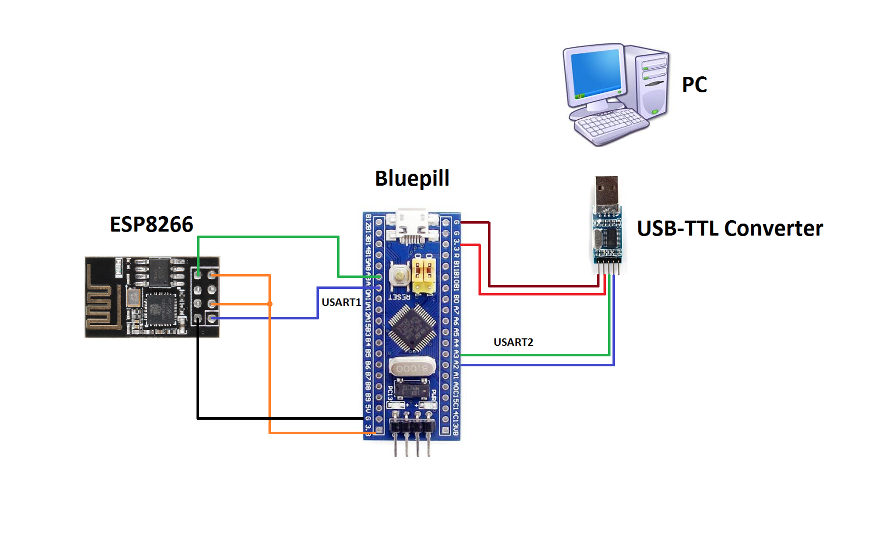
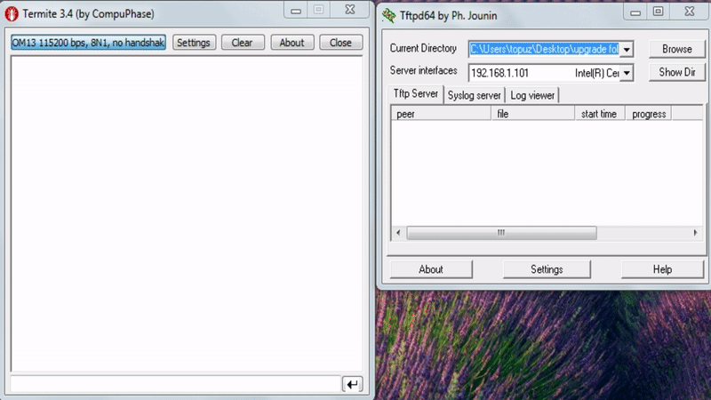

# STM32 Remote Firmware Update
Bu projede STM32F103C8T6(blue pill) ve ESP8266 kullanılarak uzaktan yazılım güncelleme ile ilgili bir örnek uygulama yapılmıştır.
Bu proje hakkında daha fazla bilgi için aşağıdaki linkten blog sitemi ziyaret edebilirsiniz.
* [Uzaktan Gömülü Yazılım Güncelleme](https://mehmettopuz.net/uzaktan-gomulu-yazilim-guncelleme/.html)

## Bağlantı Şeması

## UART2 Üzerinden Güncelleme Adımlarını İzleme

